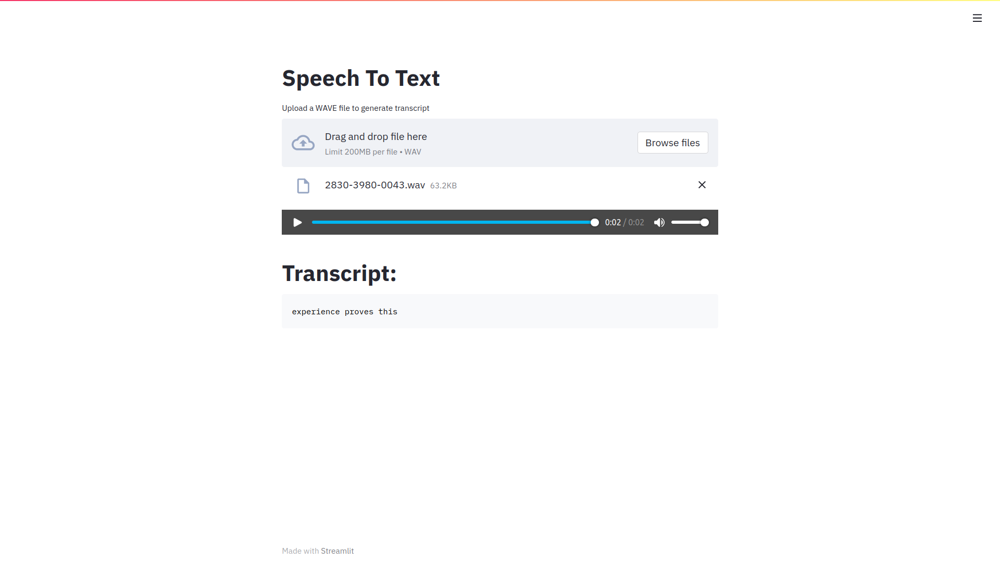

# Speech to Text



Small app for Speech To Text model development.

- Easy to upload audio file
- Execute model seamlessly on input
- Output clear and nice for user

Technologies used:

- [Coqui STT](https://github.com/coqui-ai/STT)
- [streamlit](https://github.com/streamlit/streamlit)

## Download models

Download the models from coqui before starting: https://coqui.ai/models. Then change the `settings.py` file with the correct path to model and scorer.

### English

```bash
wget https://github.com/coqui-ai/STT/releases/download/v0.9.3/coqui-stt-0.9.3-models.pbmm -P models/english
wget https://github.com/coqui-ai/STT/releases/download/v0.9.3/coqui-stt-0.9.3-models.scorer -P models/english
```

### French

- ```bash
  wget https://github.com/coqui-ai/STT-models/releases/download/french/commonvoice-fr/v0.6/model.pbmm -P models/french_common
  wget https://github.com/coqui-ai/STT-models/releases/download/french/commonvoice-fr/v0.6/fr-cvfr-2-prune-kenlm.scorer -P models/french_common
  ```
- ```bash
  wget https://github.com/coqui-ai/STT-models/releases/download/french/jaco-assistant/v0.0.1/model.pbmm -P models/french_jaco
  wget https://github.com/coqui-ai/STT-models/releases/download/french/jaco-assistant/v0.0.1/kenlm_fr.scorer -P models/french_jaco
  ```

## Start app

Run following command to start app:

```bash
docker-compose up -d
```

You can then access the app at http://localhost:8501.

Some test audio files are in the `audio` folder.
